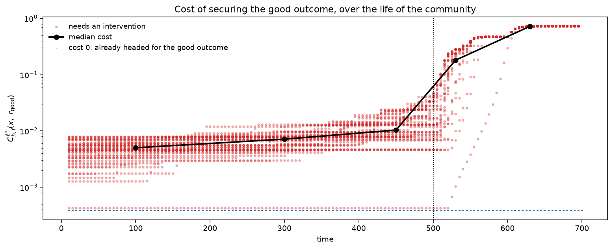
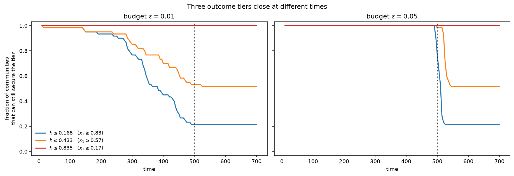
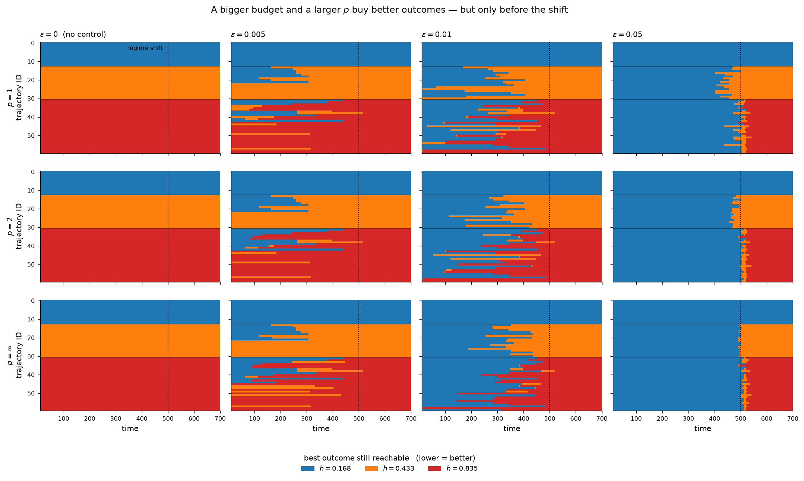

# $\varepsilon$-Control Effect Function

> Tools for computing and visualizing the **$\varepsilon$-control effect function**
> $h_f^{\varepsilon\text{-}\ell^p}$ and its three-parameter filtration, as introduced in
> *Multi-parameter persistence in dynamical systems for maximizing effects of control inputs*,
> Y. Imoto and T. Yokoyama, [arXiv:2606.05577](https://arxiv.org/abs/2606.05577).

---

## Table of Contents

* [Overview](#overview)
* [Installation](#installation)
* [Input Data Structure](#input-data-structure)
* [Quick Start](#quick-start)
* [API Reference](#api-reference)
* [Mathematical Background](#mathematical-background)
* [Examples](#examples)
* [Relation to `epsbasin`](#relation-to-epsbasin)
* [Requirements](#requirements)
* [Citation](#citation)
* [License](#license)
* [Contact](#contact)

---

## Overview

- **Inputs**
  - an **ensemble** of time series $Y = \\{ (y^{(i)}_1, \dots, y^{(i)}_{n_i}) \in \mathbb{R}^d \mid i = 1, \dots, I \\}$, where $i$ indexes the ensemble member, $n_i$ is its length and $d$ the data dimension (assuming $y^{(i)}_{t+1} = f(y^{(i)}_t)$ );
  - a scalar **evaluation function** $h$ at the **terminal time** of each member, quantifying how desirable that member's outcome is (small = good);
  - a **cost function** $c$ on pairs of states, giving the price of a control input, and a **norm parameter** $p \in [1, \infty]$.
- **Computes**
  - the $\varepsilon$-**control effect function** $h_f^{\varepsilon\text{-}\ell^p}(x)$ — the best outcome value reachable from a state $x$ when control inputs of total $\ell^p$ magnitude at most $\varepsilon$ may be applied along the orbit;
  - the $-\varepsilon$-**control effect function** $h_f^{-\varepsilon\text{-}\ell^p}(x)$ — the worst outcome an adversarial control of the same budget can force;
  - the **effect function of the difference** $h_f^{\Delta\varepsilon\text{-}\ell^p} = h_f^{\varepsilon\text{-}\ell^p} - h_f^{0\text{-}\ell^p}$, i.e. how much control pays off at each state;
  - a **minimizing controlled path** realizing the optimum (Theorem 3.12);
  - the **three-parameter filtration** $H^{\ell^p}_{f,\varepsilon,\delta} = \\{ x \mid h_f(p, \varepsilon, x) \le \delta \\}$ in (cost norm $p$, control strength $\varepsilon$, resulting value $\delta$), ready for multi-parameter persistence (Theorems 4.3 and 4.4).

The two extreme norms have direct interpretations: $p = \infty$ bounds **each individual** control input by $\varepsilon$, while $p = 1$ bounds their **total** over the whole trajectory. Both reduce to the $\varepsilon$- and $\varepsilon_\Sigma$-controlled paths of Imoto–Yokoyama, *Filtrations indexed by attracting levels and their applications*, Chaos **36** (2026), no. 5, 053144 (Remark 1 of the paper).

Values are **exact**, not swept on an $\varepsilon$ grid: the minimal control magnitude reaching each level of $h$ is obtained by shortest paths (backward dynamic programming on the time-graded transition DAG, or Dijkstra in a min-plus / min-max semiring in the general case).

---

## Installation

**From PyPI:**

```bash
pip install epscontrol
```

**From GitHub:**

```bash
git clone https://github.com/yusuke-imoto-lab/eps-control-effect.git
cd eps-control-effect
pip install -e .
```

---

## Input Data Structure

The interface takes an [`anndata`](https://anndata.readthedocs.io/) object whose `.X` holds the **time-series states**, one row per observed time point, and whose `.obs` carries the ordering and the evaluation:

| slot | key | contents |
|---|---|---|
| `.X` | — | states, `n_obs × d`; one row per (member, time) pair |
| `.obs` | `seq_id` | ensemble member each row belongs to |
| `.obs` | `time` | order of the row within its member (optional; row order used if absent) |
| `.obs` | `h` | evaluation function — a value at each member's **terminal** row, `NaN` elsewhere |
| `.uns` | `cost_matrix` | optional precomputed cost matrix $c$, `n_obs × n_obs`; built from `.X` if absent |
| `.obsm` | `plot_data` | optional 2-D coordinates for plotting instead of `.X` |

The dynamical system is the shift along each member, $f(y^{(i)}_t) = y^{(i)}_{t+1}$, so $\mathrm{dom} f$ is every non-terminal point and $\mathrm{dom} h$ every terminal point. This realizes the paper's hypothesis $X = \mathrm{dom} f \sqcup \mathrm{dom} h = \bigsqcup_{n\ge0} f^{-n}(\mathrm{dom} h)$; `check_hypotheses` reports it.

The default cost is Euclidean **within a time layer** and $\infty$ across layers, so a control input may switch between ensemble members observed at the same time. Pass `time_aligned=False`, `metric=...`, a callable `cost=...`, or a precomputed `adata.uns["cost_matrix"]` to change it.

### Example of input data

Two members of length 3 whose endpoints score 9 and 2:

```python
import numpy as np
import epscontrol as ec

adata = ec.from_ensemble(
    [
        np.array([[1.0, 6.0], [5.0, 6.0], [9.0, 9.0]]),   # member 0
        np.array([[1.0, 5.0], [5.0, 5.0], [9.0, 2.0]]),   # member 1
    ],
    values=[9.0, 2.0],          # h at the terminal time of each member
    var_names=["x1", "x2"],
)
```

which produces

`adata.X` =

| x1 | x2 |
|---:|---:|
| 1 | 6 |
| 5 | 6 |
| 9 | 9 |
| 1 | 5 |
| 5 | 5 |
| 9 | 2 |

`adata.obs` =

| index | seq_id | time | h |
|:--:|:--:|:--:|:--:|
| 0 | 0 | 0 | NaN |
| 1 | 0 | 1 | NaN |
| 2 | 0 | 2 | 9 |
| 3 | 1 | 0 | NaN |
| 4 | 1 | 1 | NaN |
| 5 | 1 | 2 | 2 |

An AnnData object assembled by hand works equally well, as long as `seq_id`, `time` and `h` are present.

---

## Quick Start

```python
import numpy as np
import epscontrol as ec

# The branching example of Figures 2 and 3 of the paper.
adata = ec.datasets.paper_example()

# Reuse one problem across budgets: the cost matrix and the shortest paths
# are solved once.
prob = ec.build_problem(adata, p=np.inf)

# h_f^{eps-l^inf} for several control budgets -> adata.obs
ec.control_effect(adata, [0.0, 1.0, 2.0], problem=prob)
adata.obs[["control_effect_eps0_pinf",
           "control_effect_eps1_pinf",
           "control_effect_eps2_pinf"]].head()

# How much does control buy at each state?
ec.effect_difference(adata, 1.0, problem=prob, key_added="gain")

# An optimal control sequence from the first state.
path = ec.minimizing_path(adata, 0, 2.0, problem=prob)
path["costs"], path["value"]      # -> array([2., 0., 0.]), 0.0

# Three-parameter filtration in (p, eps, delta).
filt = ec.filtration(prob, ps=(1.0, 2.0, np.inf), n_epsilons=11)
filt.sizes.shape                  # (3, 11, n_deltas)
```

For $x = (0, 6)^{\mathsf T}$ of the paper's example the library reproduces Example 1 exactly:

| | $\varepsilon = 0$ | $\varepsilon = 1$ | $\varepsilon = 2$ |
|---|---:|---:|---:|
| $h_f^{\varepsilon\text{-}\ell^1}$ | 6 | 5 | 2 |
| $h_f^{\varepsilon\text{-}\ell^\infty}$ | 6 | 1 | 0 |
| $h_f^{\Delta\varepsilon\text{-}\ell^1}$ | 0 | −1 | −4 |
| $h_f^{\Delta\varepsilon\text{-}\ell^\infty}$ | 0 | −5 | −6 |

---

## API Reference

### Construction

- **`from_ensemble(sequences, values=None, *, seq_names=None, seq_key="seq_id", time_key="time", h_key="h", obs=None, var_names=None)`**
  Build an AnnData object from a list of per-member arrays and their terminal evaluations. Members may have different lengths.

- **`build_problem(adata, *, p=np.inf, seq_key="seq_id", time_key="time", h_key="h", cost="distance", cost_matrix_key="cost_matrix", metric="euclidean", time_aligned=True, store_cost=True, validate=True)`**
  Assemble a `ControlProblem` $(X, f, c, h, p)$ from an AnnData object, preserving row order. Pass the result as `problem=` to the analysis functions to avoid re-solving.

- **`check_hypotheses(adata, *, eps=0.0, p=np.inf, problem=None, **kwargs)`**
  Report the paper's structural hypotheses: $\mathrm{dom} f \cap \mathrm{dom} h = \emptyset$, $X = \mathrm{dom} f \sqcup \mathrm{dom} h$, $X = \bigsqcup_n f^{-n}(\mathrm{dom} h)$, and $\mathrm{dom} h \subseteq E_c(\varepsilon) \setminus \mathrm{dom} f$.

### Effect functions

- **`control_effect(adata, eps, *, p=np.inf, key_added=None, problem=None, copy=False, **kwargs)`**
  Compute $h_f(p, \varepsilon, \cdot)$ (Definition 18) and write it to `adata.obs`. Non-negative `eps` gives the $\varepsilon$-control effect function (Definition 13); a negative `eps` — including `-0.0` — gives the $-\varepsilon$ branch (Definition 14). Default column name: `control_effect_eps{eps}_p{p}`.

- **`effect_difference(adata, eps, *, p=np.inf, key_added=None, problem=None, copy=False, **kwargs)`**
  Compute $h_f^{\Delta}(p, \varepsilon, \cdot) = h_f(p,\varepsilon,\cdot) - h_f(p,0,\cdot)$ (Definitions 15 and 16), with $\infty - \infty := 0$ and $r - \infty := -\infty$.

- **`control_cost(adata, *, p=np.inf, key_added="control_cost", problem=None, copy=False, **kwargs)`**
  Write the $h$-sublevel controllability values $C^{\ell^p}_{h,f}(x, r)$ to `adata.obsm` as an `n_obs × |Im h|` array; the levels land in `adata.uns["epscontrol"]["levels"]`.

### Reachability and paths

- **`reachable_range(adata, x, eps, ...)`** — the range $R^{\ell^p}_{h,f}(\varepsilon, x) = h([x]^{\varepsilon\text{-}\ell^p}_f \cap \mathrm{dom} h)$.
- **`reachable_domain(adata, eps, r, ...)`** — the domain $D^{\ell^p}_{h,f}(\varepsilon, r)$ as a boolean mask.
- **`minimizing_path(adata, x, eps, ...)`** — a minimizing $\varepsilon$-$\ell^p$-controlled path (Theorem 3.12), returning the visited states $N(\gamma)$, the jump targets, the individual control magnitudes, the residual budget at each state, and the terminal value.

### Multi-parameter persistence

- **`filtration(problem, *, ps=(1.0, 2.0, np.inf), epsilons=None, deltas=None, kind="value", n_epsilons=11)`**
  Build the three-parameter filtration $H^{\ell^p}_{f,\varepsilon,\delta}$ (`kind="value"`) or $H^{\ell^p}_{f,\Delta\varepsilon,\delta}$ (`kind="difference"`).
- **`Filtration`** — `.masks`, `.values`, `.sizes`, `.mask(p, eps, delta)`, `.to_frame()`, `.betti0(problem)`, and the checks `.is_filtration()` / `.is_filtration_in_p()` corresponding to assertions (1) and (2) of Theorems 4.3 and 4.4.

### Visualization

All plotting functions return `(fig, ax)` and never call `plt.show`, so panels compose freely.

- **`plot_ensemble(adata, ...)`** — trajectories with terminal states coloured by $h$.
- **`plot_effect(adata, key, *, center=None, ...)`** — states coloured by a stored effect function; `center=0` for a difference.
- **`plot_effect_heatmap(adata, problem, *, ps=(1.0, 2.0, np.inf), epsilons=(0.0, 0.005, 0.01, 0.05), sort_by_outcome=True, colors=None, t_mark=None, ...)`** — grid of heatmaps of $h_f^{\varepsilon\text{-}\ell^p}$ over time (horizontal) and trajectory (vertical), one panel per $(p, \varepsilon)$. Rows sorted by terminal outcome, so the uncontrolled panel resolves into solid bands and any other colour inside a band is a state whose fate control can still change. For ensembles whose members share observation times, and up to 12 outcome levels.
- **`plot_minimizing_path(adata, path, ...)`** — control jumps (dashed) and applications of $f$ (solid) overlaid on a 2-D plot.
- **`plot_effect_curve(problem, x, *, ps=(1.0, 2.0, np.inf), signed=True, ...)`** — $\varepsilon \mapsto h_f(p, \varepsilon, x)$ over the full parameter domain $[-\infty,-0] \sqcup [0,\infty]$.
- **`plot_filtration_sizes(filt, *, p_index=-1, ...)`** — heatmap of $|H^{\ell^p}_{f,\varepsilon,\delta}|$ over $(\varepsilon, \delta)$.

### Low-level

- **`ControlProblem(succ, cost, h, layer=None, p=np.inf, validate=True)`**
  The finite problem itself, for state spaces that are not ensembles of time series: `succ[i]` is the index of $f(x_i)$ (or `-1`), `cost` the matrix $c$, `h` the evaluation with `NaN` off its domain. Exposes `control_effect`, `effect_difference`, `control_cost`, `control_cost_exact`, `superlevel_control_cost`, `reachable_range`, `reachable_class`, `reachable_domain`, `sublevel_controllability`, `minimizing_path`, `fixed_points`, `hypotheses`, `filtration_value`, `filtration_difference`, `with_p`, and the read-only `n`, `dom_f`, `dom_h`, `levels`, `solver`.

### Datasets

- **`datasets.paper_example()`** — the branching system of Figures 2 and 3, whose values the test suite checks against Example 1.
- **`datasets.branching_ensemble(...)`** — a larger synthetic ensemble with two outcome branches.

**Chaotic competition with a regime shift** (see the ecology tutorial):

- **`datasets.chaotic_competition(*, n_members=60, t_switch=500.0, t_max=700.0, burn_in=500.0, obs_interval=5.0, embedding_dim=3, embedding_lag=1, noise=0.005, seed=0, observed_species=0, A_post=None, snap_tol=0.02)`**
  An ensemble of chaotic four-species competition trajectories that undergo a regime shift at `t_switch` and settle into alternative stable states. Only `observed_species` is observed, at interval `obs_interval`, and the state is reconstructed by delay-coordinate embedding — so the evaluation function is genuinely partial and the observable genuinely low-dimensional. `A_post` selects the post-shift regime and therefore how many values $\mathrm{Im} h$ has. Terminal abundances are snapped to the exact equilibria so that each alternative stable state contributes one level rather than numerical duplicates.

- **`datasets.simulate_competition(x0, *, A=None, A_post=None, t_switch=inf, t_max=700.0, dt=0.02, sample_every=1.0, r=None)`**
  Integrate the competitive Lotka–Volterra system, for one state or a whole ensemble at once, with an optional switch of the interaction matrix at `t_switch`. Leave `t_switch` at its default to get the pure chaotic attractor.

- **`datasets.stable_states(A, r=None, tol=1e-9)`** — the equilibria of a competitive system that resist invasion by the species left out, returned as `(surviving species, abundance vector)` pairs. **The number of stable states is the number of levels of $h$**, so this is the tool for designing your own post-shift regime: adjust `A` until the states are as numerous and as well separated in the observed coordinate as you need.

- **`datasets.competition_growth_rates`**, **`datasets.competition_matrix`** — growth rates and interaction matrix of the chaotic system of Vano et al. (2006); largest Lyapunov exponent ≈ 0.02.
- **`datasets.competition_matrix_post`** — bistable post-shift regime: two alternative stable states, species 1 at 0.714 or 0.294.
- **`datasets.competition_matrix_post3`** — tristable post-shift regime: three alternative stable states, species 1 at 0.832, 0.567 or 0.165.

### Utilities

- **`result_key(eps, p, prefix="control_effect")`** — the `adata.obs` column name a result is stored under, e.g. `result_key(1.0, np.inf)` → `'control_effect_eps1_pinf'`. Use it to read back a column without hard-coding the naming scheme.
- **`__version__`** — the installed version.

---

## Mathematical Background

An $\varepsilon$-$\ell^p$-**controlled path** of length $n$ from an initial state $x$ to a terminal state $f(x_{n-1})$ is a sequence $(x; x_0, \dots, x_{n-1}; f(x_{n-1}))$ with $x_i \in \mathrm{dom} f$ and

$$\varepsilon_0 = c(x, x_0), \qquad \varepsilon_i = c(f(x_{i-1}), x_i), \qquad \varepsilon \ge \\| (\varepsilon_i)_{i=0}^{n-1} \\|_p ,$$

i.e. each step is one control jump followed by one application of the dynamics (Definition 7). Writing $[x]^{\varepsilon\text{-}\ell^p}_f$ for the set of states so reachable from $x$, the $\varepsilon$-control effect function is

$$h_f^{\varepsilon\text{-}\ell^p}(x) = \inf h\bigl([x]^{\varepsilon\text{-}\ell^p}_f \cap \mathrm{dom} h\bigr),$$

with the convention $\inf \emptyset = \infty$ (Definition 13), and its $-\varepsilon$ counterpart takes the supremum (Definition 14). Both are monotone: weakly decreasing in $\varepsilon$ (Lemma 3.7) and, on the branch $\varepsilon \ge 0$, weakly decreasing in $p$ (Lemma 3.9), which is what makes the sublevel sets a filtration in all three parameters.

The library computes, once per problem, the array of exact-level control costs

$$C_{\text{exact}}(x, r) = \inf \\{ \varepsilon \mid x \overset{\exists}{\rightharpoonup}_{f,\varepsilon\text{-}\ell^p} h^{-1}(r) \\}, \qquad r \in \mathrm{Im} h,$$

from which every quantity above is a lookup: $h_f^{\varepsilon\text{-}\ell^p}(x) = \min \\{ r \mid C_{\text{exact}}(x, r) \le \varepsilon \\}$ and $h_f^{-\varepsilon\text{-}\ell^p}(x) = \max \\{ r \mid C_{\text{exact}}(x, r) \le \varepsilon \\}$. This is the recursion of Theorems 4.1 and 4.2 read level by level, and it returns exact values with no discretization of $\varepsilon$.

---

## Examples

* [`examples/tutorial.ipynb`](examples/tutorial.ipynb) — a full walkthrough: ensemble input, the two norms $p = 1$ and $p = \infty$, the $-\varepsilon$ branch, minimizing paths, the difference effect function, and the three-parameter filtration, first on the paper's own example and then on a larger synthetic ensemble.

* [`examples/tutorial_ecology.ipynb`](examples/tutorial_ecology.ipynb) — an applied example with a **chaotic ODE system**: four species competing under the Lotka–Volterra equations of Vano et al. (2006), whose attractor is chaotic (largest Lyapunov exponent ≈ 0.02). At $t = 500$ an environmental press disturbance makes the system bistable, and which of two alternative stable states a community reaches is decided by where chaos had carried it — a priority effect. **Only one species is observed**, at coarse intervals, and the state is reconstructed by delay-coordinate embedding, so the evaluation function is genuinely partial and the observable is genuinely low-dimensional. The control effect function then quantifies the *control window*: the cost of securing the good outcome rises roughly 100-fold across the transition, and starts rising before the disturbance is visible in the data.

  <div style="text-align:left"></div>

  The final section swaps in `competition_matrix_post3`, a post-shift regime with **three** alternative stable states, so $\mathrm{Im} h$ has three values and the question becomes graded: not *can the good outcome be saved*, but *how good an outcome is still affordable*. The tiers close at different times, the strictest first.

  <div style="text-align:left"></div>

  The last section drops the aggregation entirely: one cell per (trajectory, time), coloured by the best outcome still reachable, one panel per $(p, \varepsilon)$. Rows are sorted by terminal outcome, so the uncontrolled panel resolves into solid bands and any foreign colour inside a band marks a state whose fate control can still change.

  <div style="text-align:left"></div>

---

## Relation to `epsbasin`

[`epsbasin`](https://github.com/yusuke-imoto-lab/eps-attracting-basin) implements the *earlier* framework, where the outcome is evaluated by a **binary** criterion (target cluster or not) and the object computed is the debut function of the $\varepsilon$-attracting basin. `epscontrol` implements the *scalar-valued* generalization: the target cluster is replaced by a real-valued evaluation function $h$, and the debut function by the control effect function $h_f^{\varepsilon\text{-}\ell^p}$. The input conventions deliberately match, so an existing `epsbasin` AnnData object needs only an `h` column added at the terminal times; `p = np.inf` corresponds to `eps_attracting_basin` and `p = 1` to `eps_sum_attracting_basin`.

---

## Requirements

* Python ≥ 3.10
* numpy, pandas, scipy, scikit-learn, matplotlib, anndata

```bash
pip install -r requirements.txt
```

---

## Citation

If you use this software, please cite the paper:

> Y. Imoto and T. Yokoyama, *Multi-parameter persistence in dynamical systems for maximizing effects of control inputs*, arXiv:2606.05577 (2026). [doi:10.48550/arXiv.2606.05577](https://doi.org/10.48550/arXiv.2606.05577)

```bibtex
@article{imoto2026multiparameter,
  title  = {Multi-parameter persistence in dynamical systems for maximizing
            effects of control inputs},
  author = {Imoto, Yusuke and Yokoyama, Tomoo},
  year   = {2026},
  eprint = {2606.05577},
  archivePrefix = {arXiv},
  primaryClass  = {math.DS},
  doi    = {10.48550/arXiv.2606.05577},
  url    = {https://arxiv.org/abs/2606.05577}
}
```

and, for the underlying $\varepsilon$-attracting-basin framework:

> Y. Imoto and T. Yokoyama, *Filtrations indexed by attracting levels and their applications*, Chaos **36** (2026), 053144.

---

## License

MIT © 2026 Yusuke Imoto, Tomoo Yokoyama

---

## Contact

* **Yusuke Imoto** — [imoto.yusuke.4e@kyoto-u.ac.jp](mailto:imoto.yusuke.4e@kyoto-u.ac.jp)
* **Tomoo Yokoyama** — [tyokoyama@rimath.saitama-u.ac.jp](mailto:tyokoyama@rimath.saitama-u.ac.jp)
* GitHub: [yusuke-imoto-lab/eps-control-effect](https://github.com/yusuke-imoto-lab/eps-control-effect)
